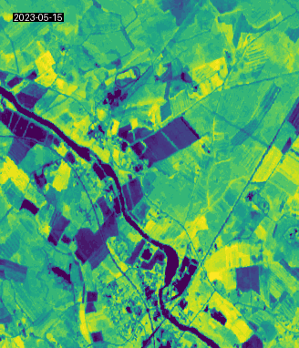
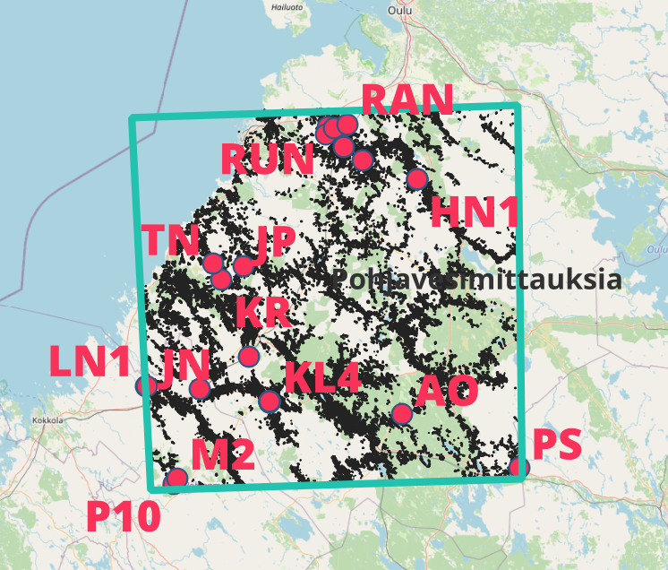

# Apu-HIKET

maxNDVI calculated from [Sentinel-2 monthly index mosaics](https://ckan.ymparisto.fi/dataset/sentinel-2-image-index-mosaics-s2ind-sentinel-2-kuvamosaiikit-s2ind "Description of the data by Syke") by Syke.

The highest NDVI value taken from the period 15.5.-31.7. The period consists of 4 mosaics: 15.5.-15.6., 1.6.-30.6., 15.6.-15.7., 1.7.-30.7.

The s2ind images downloaded from [Paituli](https://radiantearth.github.io/stac-browser/#/external/paituli.csc.fi/geoserver/ogc/stac/v1/collections/sentinel_2_monthly_index_mosaics_at_fmi
 "Description of the data in Paituli")  via STAC. See code in: [01-STAC-download-s2ind.py](https://github.com/myliheik/Apu-HIKET/blob/main/python/01-STAC-download-s2ind.py).

Each image contains the highest NDVI values per pixel. The highest NDVI value is accompanied with the date it was recorded. Demostration of a time series from April 15 - August 1, 2023 from Ruukki:

### AOI

The locations where field measurements were taken define the extent of Area-Of-Interest (AOI):

## Results

Check images in [timeseries-mittalohkot.ipynb](https://github.com/myliheik/Apu-HIKET/blob/main/notebooks/timeseries-mittalohkot.ipynb "Link to the notebook").

Note! In 2018-2021 the metadata has corrupted date information, so we don't know the date when the highest NDVI was recorded. But the date should be between the time range of 15.5.-31.7.

The results are save in Allas. See the links below.

### Tabular data

maxNDVI for all the fields in the area of interest. About 60,000 parcels. File size ~3.5M.

Public link: [https://a3s.fi/Apu-HIKET/maxNDVI-2018.csv](https://a3s.fi/Apu-HIKET/maxNDVI-2018.csv)

Public link: [https://a3s.fi/Apu-HIKET/maxNDVI-2019.csv](https://a3s.fi/Apu-HIKET/maxNDVI-2019.csv)

Public link: [https://a3s.fi/Apu-HIKET/maxNDVI-2020.csv](https://a3s.fi/Apu-HIKET/maxNDVI-2020.csv)

Public link: [https://a3s.fi/Apu-HIKET/maxNDVI-2021.csv](https://a3s.fi/Apu-HIKET/maxNDVI-2021.csv)

Public link: [https://a3s.fi/Apu-HIKET/maxNDVI-2022.csv](https://a3s.fi/Apu-HIKET/maxNDVI-2022.csv)

Public link: [https://a3s.fi/Apu-HIKET/maxNDVI-2023.csv](https://a3s.fi/Apu-HIKET/maxNDVI-2022.csv)

Public link: [https://a3s.fi/Apu-HIKET/maxNDVI-2024.csv](https://a3s.fi/Apu-HIKET/maxNDVI-2024.csv)

Public link: [https://a3s.fi/Apu-HIKET/maxNDVI-2025.csv](https://a3s.fi/Apu-HIKET/maxNDVI-2025.csv)

### Spatial data (parcel geometries)

maxNDVI for the fields with measurement data (mittalohkot). Spatial data included. File size ~100K.

Public link: [https://a3s.fi/Apu-HIKET/maxNDVI-fieldData-2018.gpkg](https://a3s.fi/Apu-HIKET/maxNDVI-fieldData-2018.gpkg)

Public link: [https://a3s.fi/Apu-HIKET/maxNDVI-fieldData-2019.gpkg](https://a3s.fi/Apu-HIKET/maxNDVI-fieldData-2019.gpkg)

Public link: [https://a3s.fi/Apu-HIKET/maxNDVI-fieldData-2020.gpkg](https://a3s.fi/Apu-HIKET/maxNDVI-fieldData-2020.gpkg)

Public link: [https://a3s.fi/Apu-HIKET/maxNDVI-fieldData-2021.gpkg](https://a3s.fi/Apu-HIKET/maxNDVI-fieldData-2021.gpkg)

Public link: [https://a3s.fi/Apu-HIKET/maxNDVI-fieldData-2022.gpkg](https://a3s.fi/Apu-HIKET/maxNDVI-fieldData-2022.gpkg)

Public link: [https://a3s.fi/Apu-HIKET/maxNDVI-fieldData-2023.gpkg](https://a3s.fi/Apu-HIKET/maxNDVI-fieldData-2023.gpkg)

Public link: [https://a3s.fi/Apu-HIKET/maxNDVI-fieldData-2024.gpkg](https://a3s.fi/Apu-HIKET/maxNDVI-fieldData-2024.gpkg)

Public link: [https://a3s.fi/Apu-HIKET/maxNDVI-fieldData-2025.gpkg](https://a3s.fi/Apu-HIKET/maxNDVI-fieldData-2025.gpkg)

